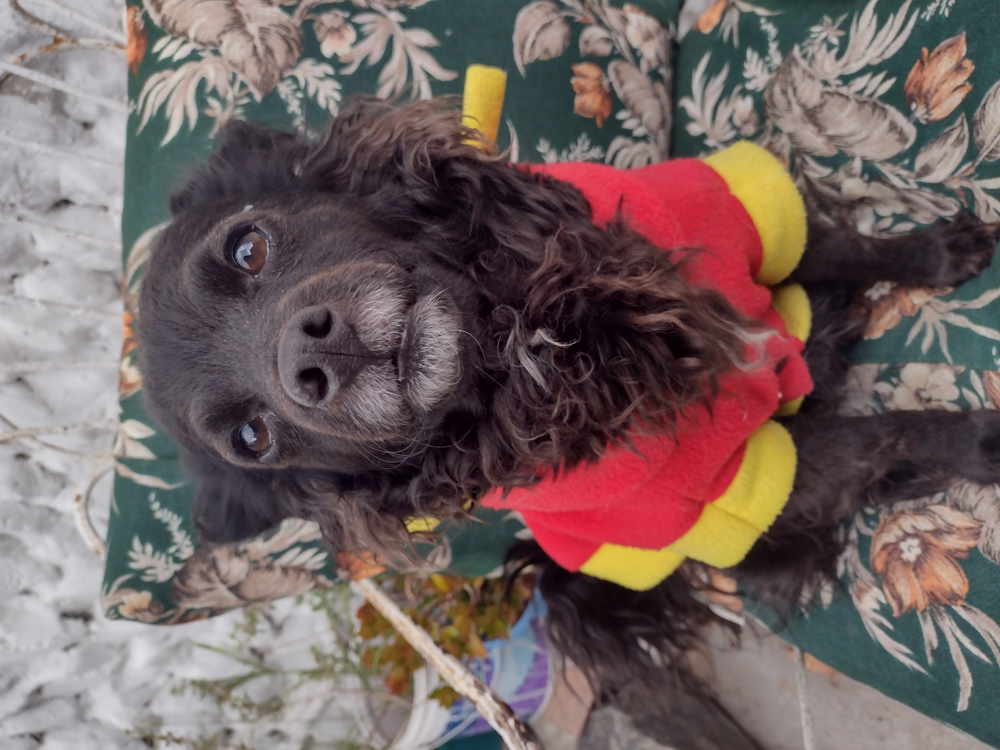
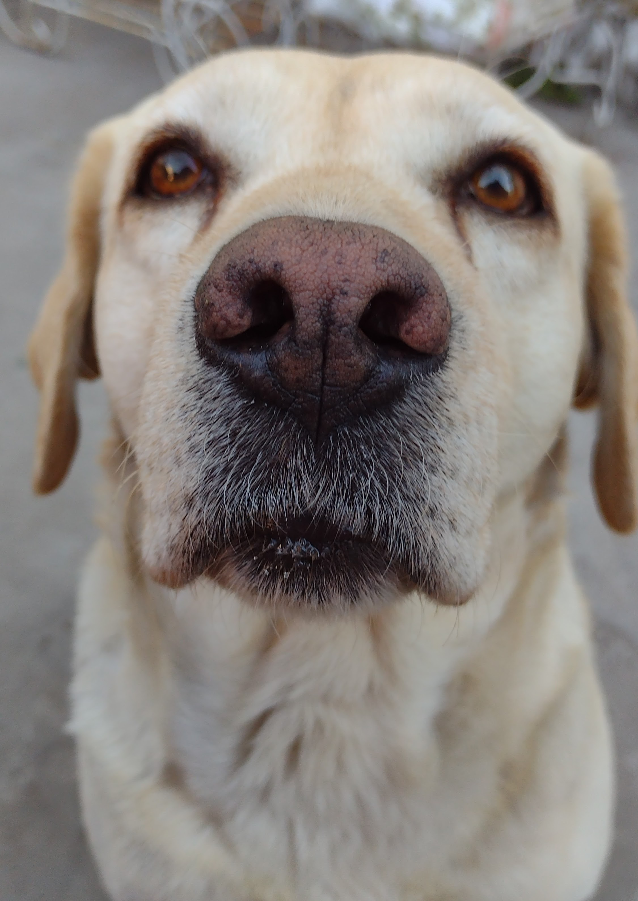

# Hola, soy Natasha &#x1F590; 

Mi nombre es ${\color{pink}Natasha \space Arias}$ , me pueden decir ${\color{pink}nat}$ o ${\color{pink}nati}$ . Mi número de legajo es: **177.381-1**

Estoy cursando la carrera de **Ing. En Sistemas** pero también pase por Medicina y Bioquimica en la UBA, ya que desde muy chica queria dedicarme al sector de la salud, pero por algunas cuestiones de la vida termine aca, encontrando una nueva pasión que desconocia.
Tengo varios hobbies como: 
- &#x1F3AC; ver peliculas /series 
- &#x1F4D6; leer mangas
- &#x1F4BB; jugar en la pc 
- &#x1F4F8; sacar fotos 
- &#x1F913; y recientemente, empece a hacer cursos

Por el momento solo realice 2, uno de Testing y otro de desaroollo web. 
También trabajo por cuenta propia como niñera / particular aunque aunque uno de mis objetivos a lo largo del año es trabajar como programadora.

***

Comparto una foto en la patagonia ya que también, además de sacar fotos, me gusta viajar: 

***

_Estuve viendo que compartian fotos de sus mascotas y yo tambien quise. Estas son mis 2 bendiciones:_

 

Sin mas que agregar, espero que sea una buena cursada para todos por igual. Saludos &#x1F497;

